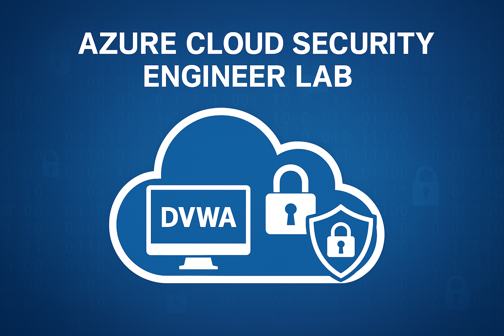
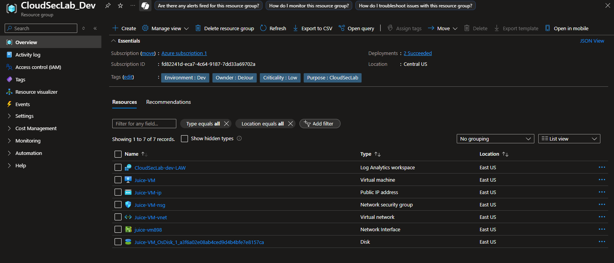
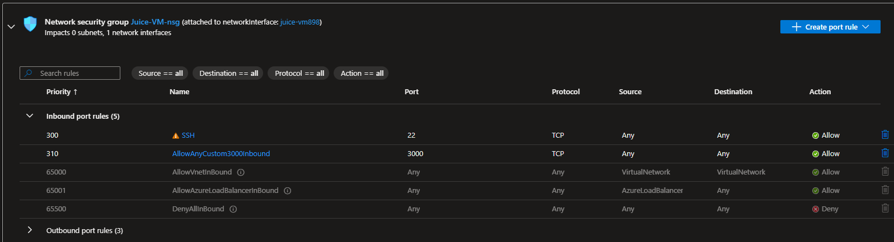
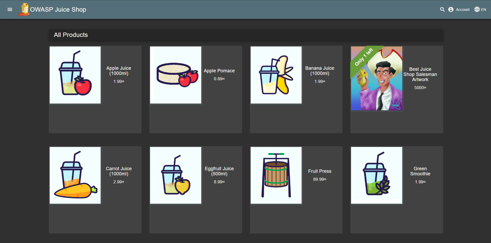
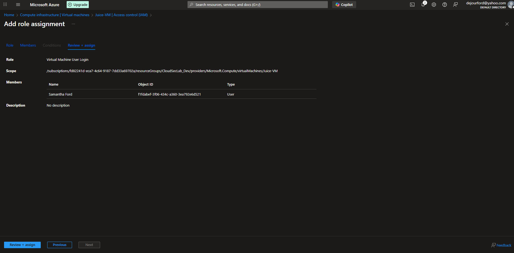
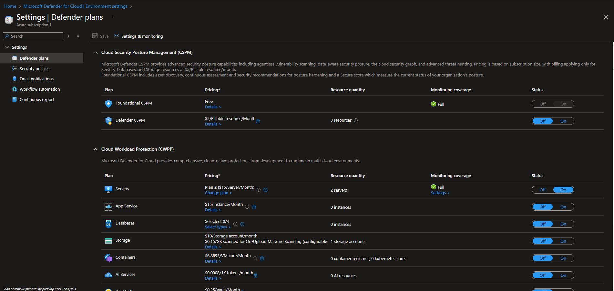
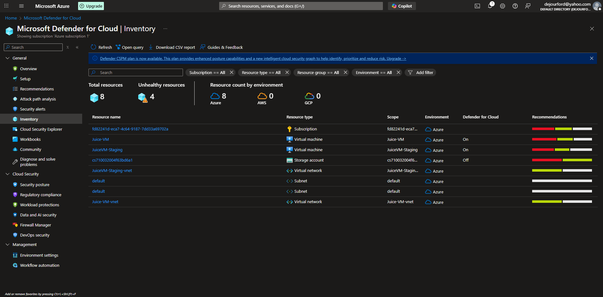
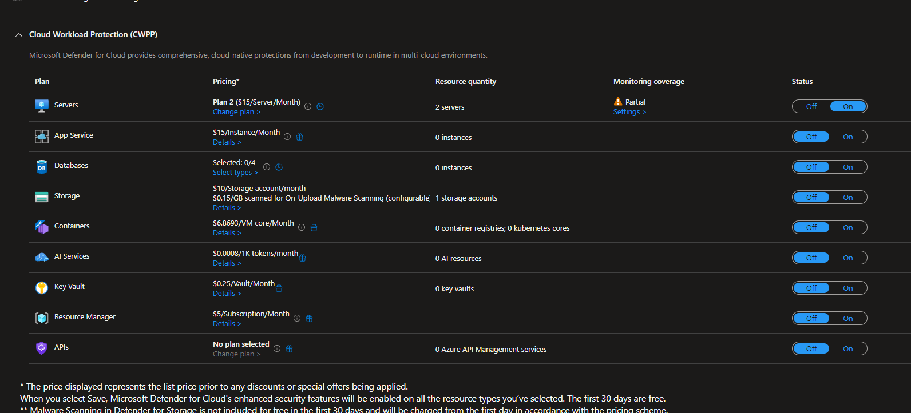
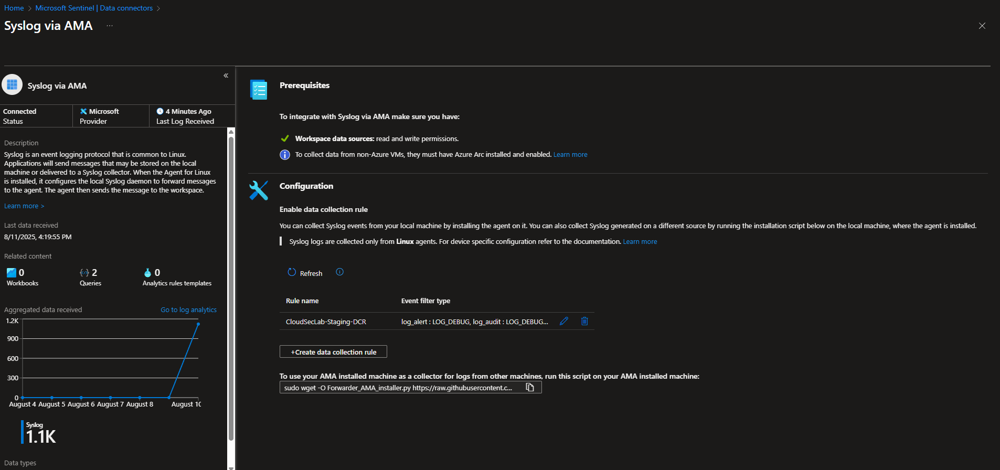

# Cloud Security Lab

<div align=center>
    <br />
</div>

## Purpose

This lab was created to simulate real-world cloud infrastructure and security operations in Microsoft Azure. It demonstrates how to securely deploy, monitor, and defend a vulnerable web application using core Azure services such as Virtual Machines, Network Security Groups, Microsoft Defender for Cloud, and Microsoft Sentinel.

The goal is to practice cloud security engineering skills including environment hardening, threat detection, logging, and incident response — all within segmented `dev`, `staging`, and `prod` resource groups to reflect enterprise architecture and operational maturity.


## Tools Utilized

* Microsoft Azure
* Ubuntu Virtual Machine
* Kali Linux (Attacker Machine)
* Juice Shop Application
* Network Security Group (NSG)
* Log Analytics Workspace (LAW)
* Microsoft Defender for Endpoint
* Microsoft Sentinel
* Web Application Firewall (WAF)

## Lab Architecture

| Feature                         | CSL_dev                        | CSL_staging                              | CSL_prod                                |
|---------------------------------|--------------------------------|-------------------------------------------|------------------------------------------|
| VM/App                          | Juice Shop              | Juice Shop                         | Juice Shop                        |
| VM Size                         | B1s (small)                    | B2s (medium)                              | B2s or larger                            |
| Network Security Group (NSG)    | Open to all (for attack simulation) | Only my IP                        | Strict — limited IPs, WAF/Firewall       |
| Defender for Cloud              | Optional or Plan 1             |  Enabled (Plan 2)                        |  Enabled (Plan 2 + alerts)             |
| Log Analytics Workspace         | Optional/basic logging         | Connected to shared workspace             |  Connected to Sentinel workspace       |
| Microsoft Sentinel              | Not required                   | Used for hunting + testing rules          |  Used for live detection & alerting    |
| Logging Level                   | Minimal                        | Moderate (Syslog, metrics)                |  Full diagnostic logging               |
| Automation                      | None                           | Optional manual remediation               |  Logic Apps for response               |
| Alerts                          | None                           | Manual triage                             |  Custom analytics rules + response     |
| Tags                            | `Environment=Dev`              | `Environment=Staging`                     | `Environment=Prod`, `Criticality=High`  |
| Access Controls (RBAC)          | Owner access                   | Least privilege for staging users         | Strict RBAC (read-only for most users)  |


## Procedure

Created `CloudSecLab_dev` Resource Group and its resources

<div align=center>
    <br />
</div>
 
<hr>

SSH into machine, update packages, install docker, and run Juice Shop on port 3000. 


`Updating Packages and Installing Docker`

```
udo apt update && sudo apt install -y docker.io
sudo systemctl start docker
sudo systemctl enable docker
sudo usermod -aG docker $USER
```

`Run Juice Shop on Port 3000`

```
ocker run -d \
  --name juice-shop \
  -p 3000:3000 \
  bkimminich/juice-shop
```

<hr>

Create `NSG` inbound rule to allow TCP connection over port 3000.


<div align=center>
    <br />
</div>

<hr>

Access Juice Shop Application via:

`http://<vm-public-ip>:3000`


<div align=center>
    <br />
</div>

<hr>

Create `a-sford` user in Entra ID, assign `Virtual Machine User Login` access control to user, and locally created user on Linux machine.


<div align=center>
    <br />
</div>


<div align=center>
    <br />
</div>


```
sudo adduser a-sford
ssh-keygen -t rsa -b 4096 -f ~/.ssh/id_rsa_a_sford
ssh-copy-id -i ~/.ssh/id_rsa_a_sford.pub a-sford@<vm-public-ip>
```

<hr>

Install rsyslog and forward from journalId

```
sudo apt update
sudo apt install rsyslog -y
sudo systemctl enable rsyslog
sudo systemctl start rsyslog
```

<hr>

Repeat process for Staging and Production environments, then connect Microsoft Defender for Cloud and Microsoft Sentinel to each environment.

<div align=center>
    <br />
</div>


<div align=center>
    <br />
</div>


<div align=center>
    <br />
</div>

<div align=center>
    <br />
</div>


