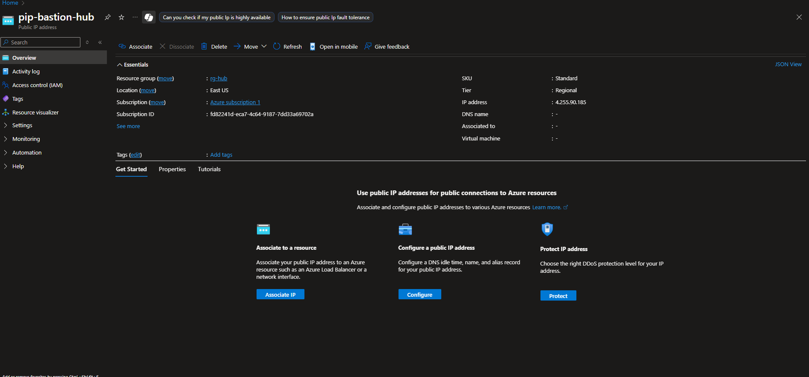
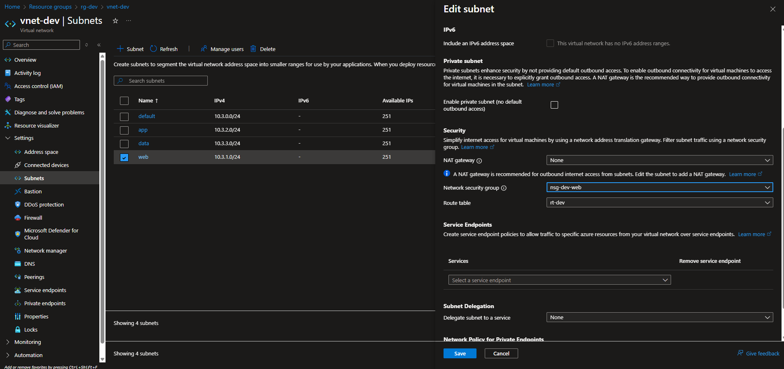
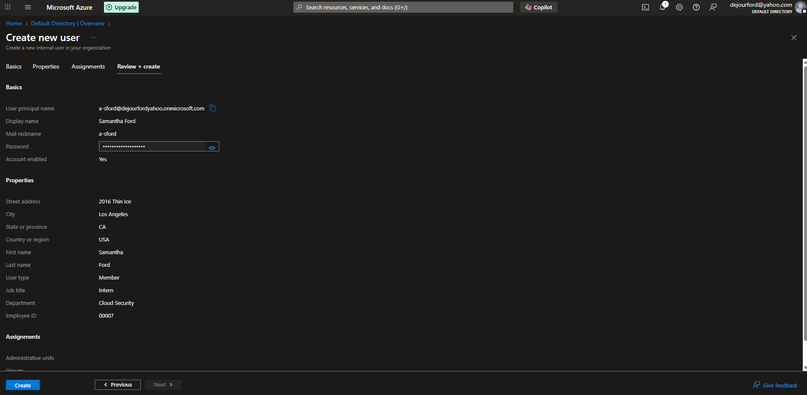

# Cloud Security Lab

<div align=center>
    <br />
</div>

## Purpose

This lab was created to simulate real-world cloud infrastructure and security operations in Microsoft Azure. It demonstrates how to securely deploy, monitor, and defend a vulnerable web application using core Azure services such as Virtual Machines, Network Security Groups, Microsoft Defender for Cloud, and Microsoft Sentinel.

The goal is to practice cloud security engineering skills including environment hardening, threat detection, logging, and incident response — all within segmented `dev`, `staging`, and `prod` resource groups to reflect enterprise architecture and operational maturity.


## Tools Utilized

* Microsoft Azure
* Ubuntu Virtual Machine
* Kali Linux (Attacker Machine)
* Juice Shop Application
* Network Security Group (NSG)
* Log Analytics Workspace (LAW)
* Microsoft Defender for Endpoint
* Microsoft Sentinel
* Web Application Firewall (WAF)

## Lab Architecture

| Feature                         | CSL_dev                        | CSL_staging                              | CSL_prod                                |
|---------------------------------|--------------------------------|-------------------------------------------|------------------------------------------|
| VM/App                          | Juice Shop              | Juice Shop                         | Juice Shop                        |
| VM Size                         | B1s (small)                    | B2s (medium)                              | B2s or larger                            |
| Network Security Group (NSG)    | Open to all (for attack simulation) | Only my IP                        | Strict — limited IPs, WAF/Firewall       |
| Defender for Cloud              | Optional or Plan 1             |  Enabled (Plan 2)                        |  Enabled (Plan 2 + alerts)             |
| Log Analytics Workspace         | Optional/basic logging         | Connected to shared workspace             |  Connected to Sentinel workspace       |
| Microsoft Sentinel              | Not required                   | Used for hunting + testing rules          |  Used for live detection & alerting    |
| Logging Level                   | Minimal                        | Moderate (Syslog, metrics)                |  Full diagnostic logging               |
| Automation                      | None                           | Optional manual remediation               |  Logic Apps for response               |
| Alerts                          | None                           | Manual triage                             |  Custom analytics rules + response     |
| Tags                            | `Environment=Dev`              | `Environment=Staging`                     | `Environment=Prod`, `Criticality=High`  |
| Access Controls (RBAC)          | Owner access                   | Least privilege for staging users         | Strict RBAC (read-only for most users)  |


## Procedure

Step 1) Create the Hub Resource Group

This step is the creation of the central entity (hub) resource group that other peripheral entities will connect to. 

<hr>

Step 2) Create the Virtual Network

This step is the creation of the virtual network for the central hub. It will contain subnets for Bastion, Firewall, and shared services.


<div align=center>
    <br />
</div>

<hr>

Step 3) Create a public IP for Bastion

This step is the creation of a public IP address for Bastion. I only selected One zone for cost-saving purposes but in a real environment, all zones would be selected to increase resiliency.

<div align=center>
    <br />
</div>

<hr>

Step 4) Create Public IP Address for Azure Firewall

A public IP Address for the Azure Firewall was created to be used by the Azure Firewall.

<hr>

Step 5) Deploy Azure Firewall in the Hub

The Azure Firewall is deployed in the hub to serve as a central security checkpoint for the whole environment to control inbound and outbound traffic.


<div align=center>
    <br />
</div>

<hr>

Step 6) Create Outbound and Inbound Firewall Groups 

Outbound and Inbound firewall group rules were created as parent containers for all individual outbound and inbound rules. 


<div align=center>
    <br />
</div>

<hr>

Step 7) Create Outbound HTTPS and DNS rules

HTTPS and DNS rules were created to allow the Virtual Machines to make https connections over the internet and also resolve the IPs. The DNS rule has a destination address of Azure's DNS IP of 168.63.129.16. A separate deny-rule was created to deny all other outbound requests that weren't https or to the Azure DNS server.


<div align=center>
    <br />
</div>


<div align=center>
    <br />
</div>


<div align=center>
    <br />
</div>

Step 8) Create Route Table

Separate route tables were created for each environment so that the VM traffic is routed through the created firewall. Routes were then added and associated with the respective subnet.


<div align=center>
    <br />
</div>

<hr>

Step 8) Create spokes for segmentations (resource groups)

Development, Staging, and Production resource groups were created to connect to the hub.


<div align=center>
    <br />
</div>

<hr>

Step 9) Add peering in both directions for each segmented resource group.

Peering the resource groups in both directions allows all virtual networks to be interconnected.


<div align=center>
    <br />
</div>


<div align=center>
    <br />
</div>

<hr>

Step 10) Create NSG for each segmented resource group and associate it.

Associating the NSG to its respective subnet, enables inbound/outbound rule application for the subnet.


<div align=center>
    <br />
</div>

<hr>

Step 11) Create VM

SSH into machine, update packages, install docker, and run Juice Shop on port 3000. 


`Updating Packages and Installing Docker`

```
sudo apt update && sudo apt install -y docker.io
sudo systemctl start docker
sudo systemctl enable docker
sudo usermod -aG docker $USER
```

`Run Juice Shop on Port 3000`

```
docker run -d \
  --name juice-shop \
  -p 3000:3000 \
  bkimminich/juice-shop
```

<hr>

Step 12) Create a user


Create `a-sford` user in Entra ID, assign `Virtual Machine User Login` access control to user, and locally created user on Linux machine.


<div align=center>
    <br />
</div>


<div align=center>
    <br />
</div>


```
sudo adduser a-sford
ssh-keygen -t rsa -b 4096 -f ~/.ssh/id_rsa_a_sford
ssh-copy-id -i ~/.ssh/id_rsa_a_sford.pub a-sford@<vm-public-ip>
```

